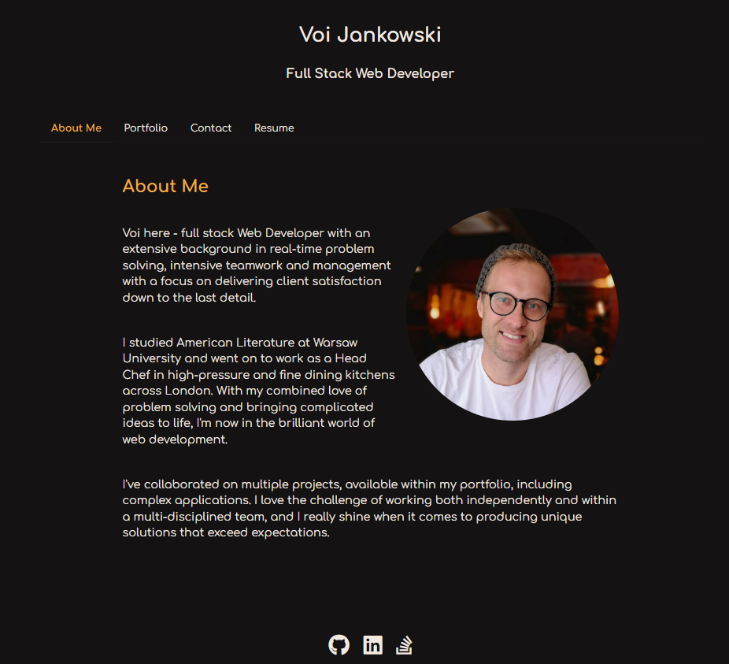
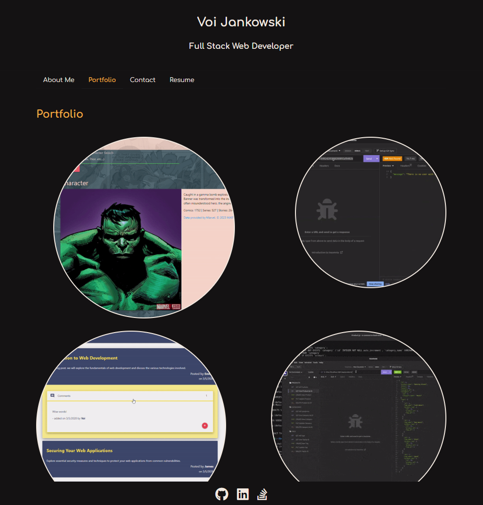
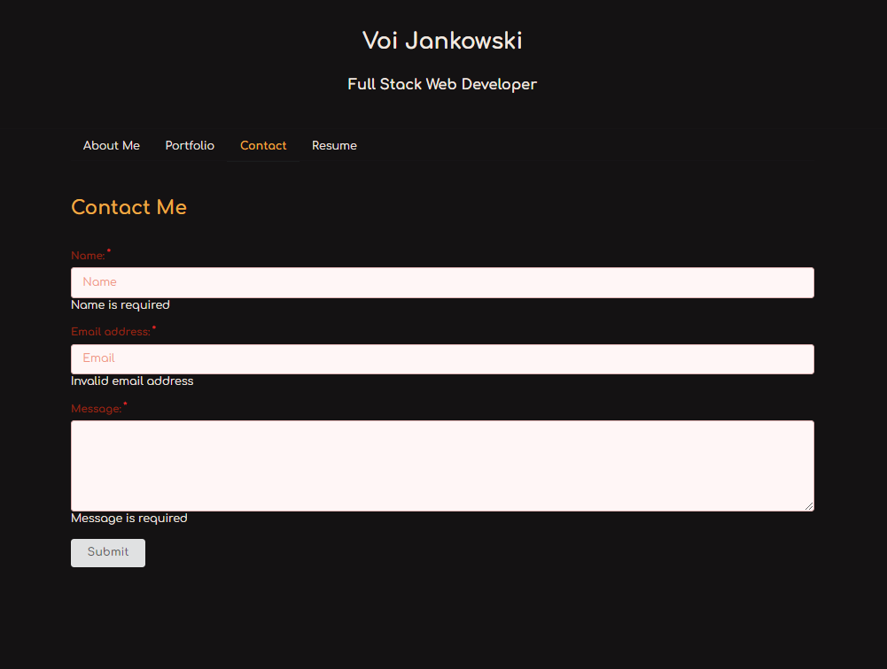
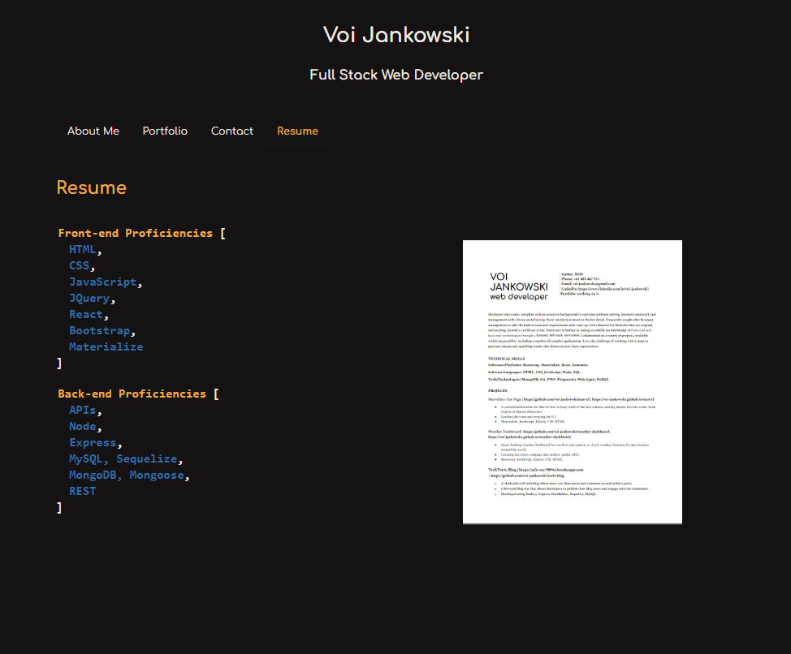

# Voi Jankowski's Portfolio

## Description

My Portfolio Webpage is a showcase of my skills, projects, and achievements as a Full Stack Web Developer. It provides an overview of my work experience, education, and contact information. Visitors can explore my projects, view my resume, and get in touch with me for potential collaborations or inquiries.

## Table of Contents

- [Features](#features)
- [Screenshots](#screenshots)
- [Technologies Used](#technologies-used)
- [Usage](#usage)
- [License](#license)
- [Contact and Links](#contact)

## Features

- **Project Showcase**: Display a curated selection of my projects, including descriptions, screenshots, and links to live demos or repositories.
- **Resume**: Provide a downloadable version of my resume in PDF format.
- **Contact Form**: Allow visitors to send messages directly to me through a contact form on the webpage.
- **Responsive Design**: Ensure the webpage is fully responsive and optimized for various devices and screen sizes.

## Screenshots

Include screenshots or GIFs showcasing the layout and design of your webpage.

## Technologies Used

- React: JavaScript library for building the user interface.
- HTML5: Markup language for structuring the webpage.
- CSS3: Styling language for customizing the appearance of the webpage.
- Semantic UI: UI component library for styling and layout.
- Node.js: JavaScript runtime environment for server-side scripting.

## Usage

1. The page opens on About Me section, with short intro and my photo.

2. When you click on the menu items at the top of the page, you are taken to the respective sections.
3. In Porfolio you are presented with bubbles with GIF images of some of my projects. When you poit your curson=r on any of those you can see the links to the live page and GitHub repo of that project.

4. In the Contact section there is a form you can fill out to message me. All the fields are madatory, you will be alerted if you are missing any of those before sending.

5. In the Resume section you are presented with the list of my profieciencies and a link to access my Resume.

6. In the footer of the page you can find links to my GitHub, LinkedIn and Stack Overflow.

## License

This project is licensed under the MIT License. See the [LICENSE](./LICENSE) file for more information.

## Contact and Links

If you have any questions or would like to get in touch, feel free to reach out to me through the following channels:

- GitHub: [github.com/voi-jankowski](https://github.com/voi-jankowski)
- Email: voi.jankowski@gmail.com
- LinkedIn: [linkedin.com/in/voi-jankowski/](https://www.linkedin.com/in/voi-jankowski/)

The page can be accessed [here]() .
Thank you for visiting my portfolio webpage! I hope you find it informative and engaging.
